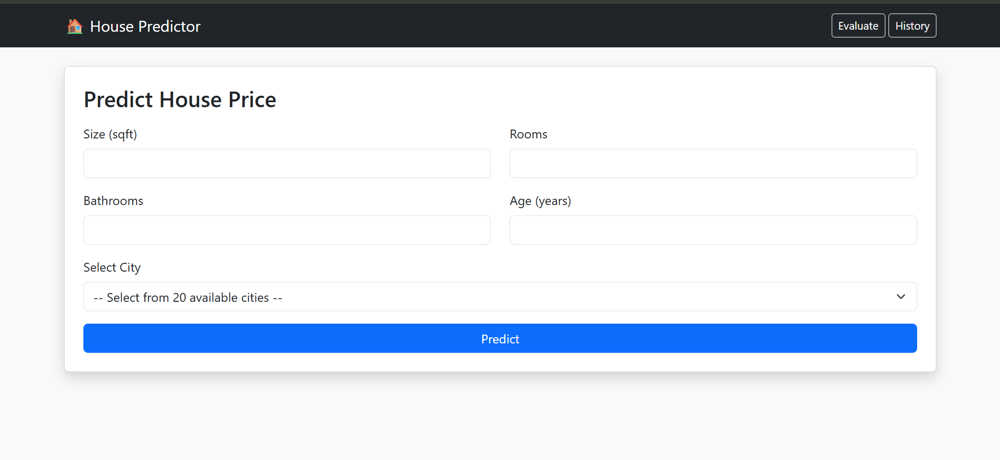
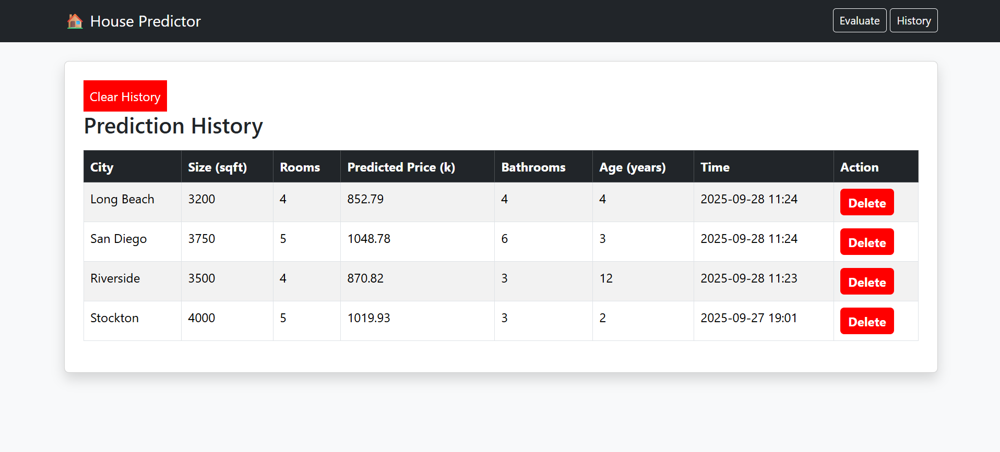
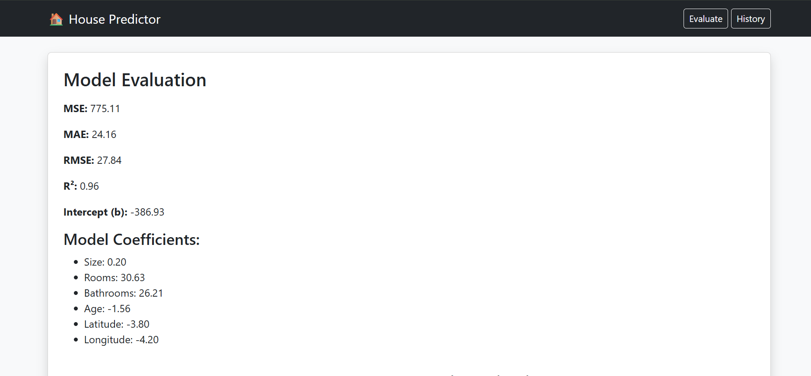
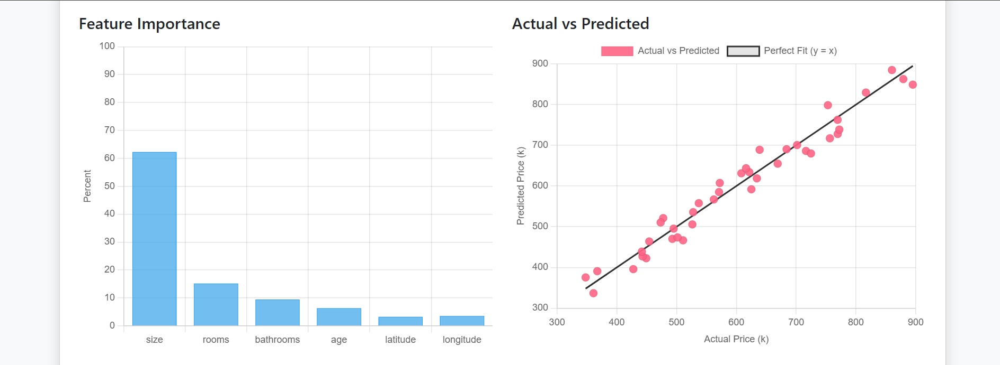
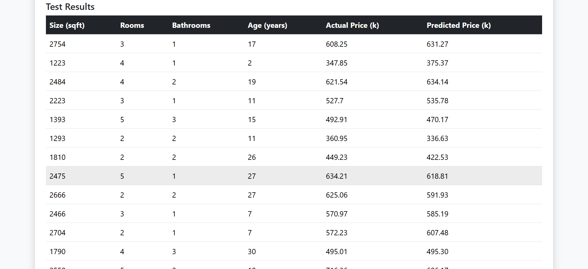

# House Price Predictor

A Django web application that predicts house prices in cities using **Linear Regression**.  
Users can enter house details and location to get an estimated price, view prediction history, and analyze model performance.

---

## 🌟 Features

- Predict house prices based on:
  - Size (sqft)
  - Number of rooms
  - Bathrooms
  - Age of the house
  - City 
- Stores and displays prediction history.
- View **model evaluation metrics**:
  - MSE, MAE, RMSE, R²
  - Coefficients and feature importance
  - Actual vs predicted scatter plot
- Interactive charts with **Chart.js**.
Note: This project uses a synthetic (dummy) dataset created for learning and demonstration purposes. Predictions are not based on real-world housing market data.

---

## 🖥️ Screenshots

**Prediction Form**  

**Prediction History**  

**Model Evaluation**  

---

## 🏠 Usage

1. Open the app in your browser (after running the Django server).  
2. Fill in house details and select a city.  
3. Click **Predict** to see the estimated price.  
4. View or clear prediction history.  
5. Check **Evaluation** page to see metrics and charts.

---

## 📊 Model Details

- Model: **Linear Regression**  
- Features:
  - Size (sqft)
  - Rooms
  - Bathrooms
  - Age
  - Latitude
  - Longitude
- Dataset: Synthetic (10 houses per city)  
- Metrics saved in `metrics.csv`; test predictions in `test_results.csv`.

---

## 🙏 Acknowledgements

- [Django](https://www.djangoproject.com/)  
- [Scikit-learn](https://scikit-learn.org/)  
- [Pandas](https://pandas.pydata.org/)  
- [Chart.js](https://www.chartjs.org/)
